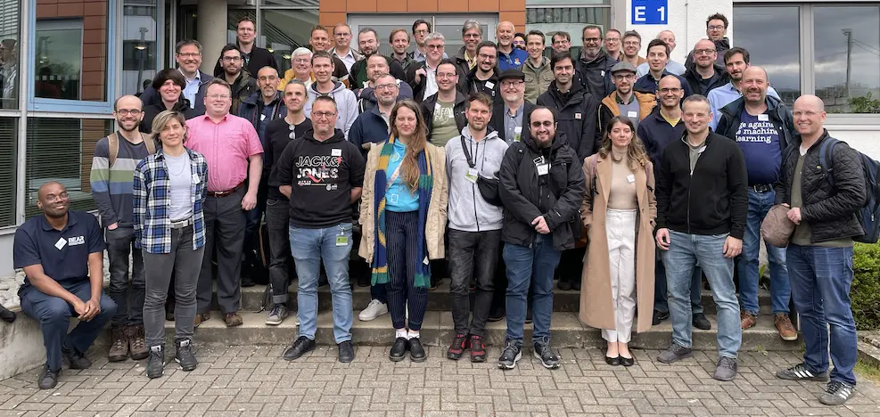
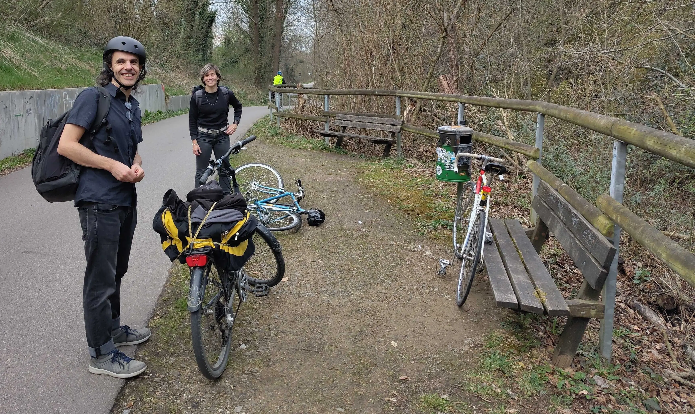
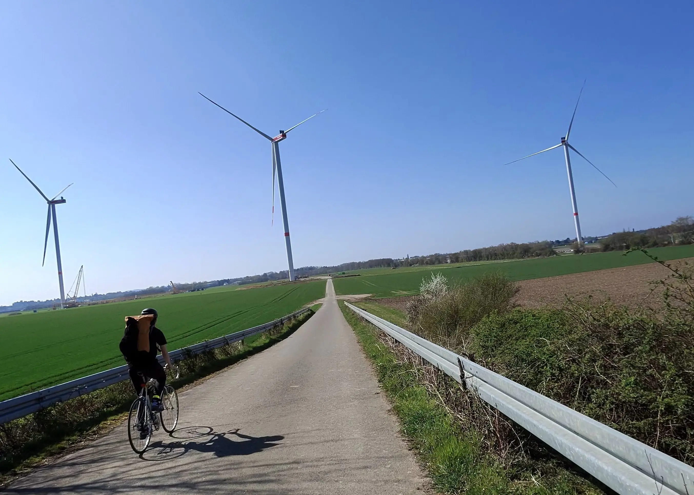
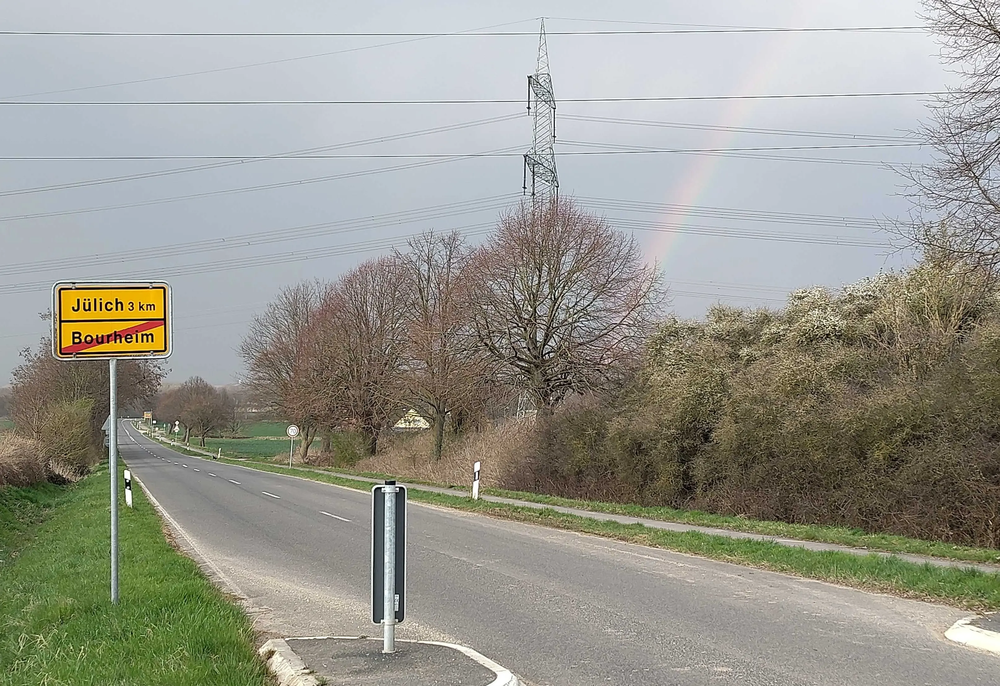
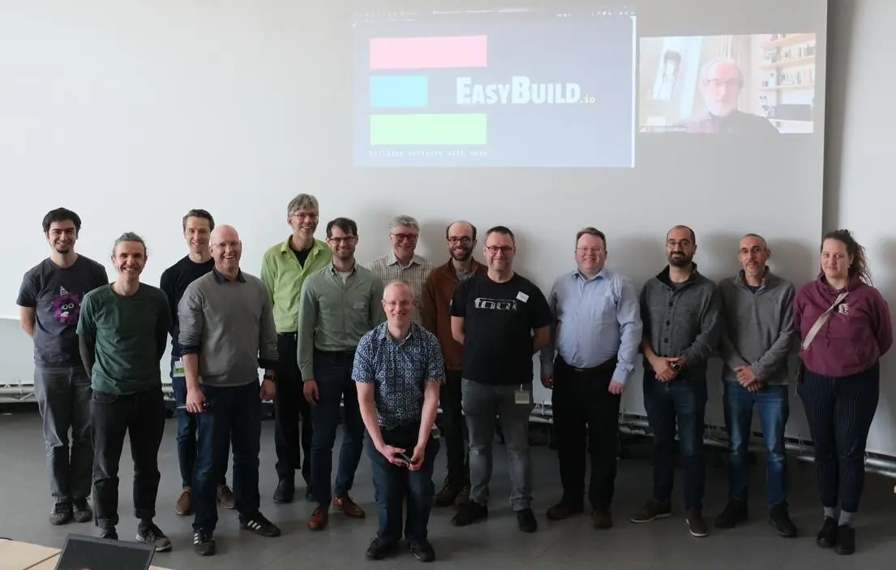
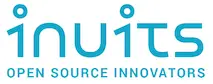

---
authors:
  - hvelab
  - boegel
date: 2025-03-28
slug: eum25
hide:
  - navigation
---

# 10th EasyBuild User Meeting (EUM'25)

This first blog post reports on the [10th EasyBuild User Meeting (EUM'25)](https://easybuild.io/eum25),
which took place 25-27 March 2025 at the Jülich Supercomputing Centre (JSC) in Germany.

<!-- more -->

## Day 0 (Monday 24 March 2025)

### Travel

Even though it was a bit challenging to reach Jülich, seats for in-person attendance for the event were fully booked a month before the event,
even before the program was made public!

50 people coming by all means possible (car, train, plane, bus, minibus and even bike) made it to the venue,
in addition to 90 attendees who registered to follow the event online.

Cintia, Sam, and Alex came by bike from Aachen to Jülich.

At some point a rainbow was even guiding them!

---

## Day 1 (Tuesday 25 March 2025)

### Welcome

In-person attendees had a first hour of meet and greet on Tuesday morning.
Three different coffee mugs and a wide variety of stickers were available to bring back home,
free of cost thanks to the generous sponsoring of [Microsoft](https://azure.microsoft.com/en-us) +
[NVIDIA](https://www.nvidia.com/) + [INUITS](https://inuits.eu/).

Once everybody chose a seat, the 10th EasyBuild User Meeting was ready to start...

During the welcome session, it was revealed that the social event on Wednesday would be competitive karting :racing_car: at
the [Michael Schumacher Karting Center](https://www.ms-kartcenter.de/), fully sponsored by [Do IT Now](https://www.doitnowgroup.com)!

### State of the Union

First day of talks was packed, starting with the usual *EasyBuild State of the Union* presentation by Kenneth Hoste
(Ghent University) -- slides available [here](https://users.ugent.be/~kehoste/eum25/000_eum25_welcome.pdf).

The big highlight surrounding this event is the release of [**EasyBuild 5.0**](https://docs.easybuild.io/easybuild-v5/) :tada: .
Congratulations to all contributors and maintainers for the major milestone!

Some other crazy news from the EasyBuild community is the launch of the [EasyBuild + EESSI shop](https://shop.easybuild.io).
All the profits generated by the shop will be destined to cover future events merchandise.

### EasyBuild 5.0

EasyBuild version 5.0 was covered in detail by the following talk, given by Simon Branford (University of Birmingham), EB maintainer.
He explained all the breaking changes, updates and new features. It is expected from now on to make a major release of EasyBuild every two years.

### EasyBuild site talks

John Dey (Fred Hutch) and Bart Oldeman (Digital Research Alliance of Canada) gave their site talks illustrating the use of EasyBuild in
their respective institutions, remarking some [`easy_update`](https://github.com/fizwit/easy_update) status updates, new tools to build
containers with EasyBuild, user tendencies, special software stacks and their site-specific systems.

### Technical talks

After lunch, a whole round of technical talks filled the afternoon. Starting with Alex Domingo (a.k.a [`@lexming`](https://github.com/lexming),
also an EasyBuild maintainer, Vrije Universiteit Brussel) lecturing on *"Controlling the shell environment in EasyBuild v5.0"*, with some amazing
improvements on how to handle environment variables and how they affect the module files in this new EasyBuild release.

Then, Jan André Reuter (JSC) gave tips and tricks on how to contribute (and not break) EasyBuild releases. :sweat_smile:

### Lmod vs Environment Modules

A friendly competition followed with the two presentations of Robert McLay (TACC - Lmod) and Xavier Delaruelle (CEA - Environment Modules),
each one presenting updates on the implementation of environment modules they lead.

*They got along during the dinner!*

### Beyond EasyBuild

After the coffee break Alexander Grund (TU Dresden) started the session showcasing their work on secure workflows for shared HPC systems
to handle sensitive data with minimal performance overhead.

In the next talk, Jayesh Badwaik (JSC) addressed reproducibility challenges in continuous benchmarking within the early access program for JUPITER.

Next up was Michael Klemm (AMD) to present an insightful talk about the AMD ROCm™ Platform, providing an overview of
its open-source stack and how it enables high-performance computing with AMD Instinct™ accelerators.

Moving on another short break, two remote talks closed the first day. The first one introducing Open OnDemand, presented by the Ohio Supercomputing Center team.

The second one was the Spack status update and introduction to the [High Performance Software Foundation (HPSF)](https://hpsf.io/), given by the same Todd Gamblin.
He promised (again) that Spack v1.0 is coming soon (right for the ISC'25, so mark your calendar!).

### Sponsored group dinner

The group dinner, sponsored by [Jülich Supercomputing Centre (JSC)](https://www.fz-juelich.de/en/ias/jsc) was at Restaurant Hexenturm at downtown Jülich.

We got to eat traditional German and Eastern European food in a unique location. :hamburger: :beer:

-----

## Day 2 (Wednesday 26 March 2025)

### Keynote talk by Jeff Hammond

The second day started at 9am sharp to the keynote of Jeff Hammond (NVIDIA) entitled *"Modern MPI and what you need to know about it"*.
He highlighted all the efforts in the MPI ABI standarization and modern developments in MPI.
Definitely worth a re-watch [here](https://youtu.be/2-4ph2vryiw?list=PLhnGtSmEGEQi5xRViGJwLqZg3HMQJG0QM)
(slides available [here](https://users.ugent.be/~kehoste/eum25/014_eum25_keynote_JeffHammond_MPI.pdf)).

### More EasyBuild talks

Talks continued with Davide Grassano (CECAM) presenting *"A new LLVM toolchain"* for EasyBuild.
He explained how the compiler infrastructure works, and compared existing features and performance against a current GCC toolchain.

After the coffee break, Bart Oldeman lectured about the linear algebra infrastructure in EasyBuild's toolchains,
how they work and how to squeeze them to get the best performance. Afterwards, Jens Henrik Göbbert (JSC) spoke
about OpenGL support in EasyBuild, highlighting how libglvnd works to integrate OpenGL API calls across different vendors.

### Talks by JSC

After lunch, Brian Wylie (JSC) showcased the work being done by the [Performance Optimisation and Productivity (POP) EuroHPC Centre-of-Excellence](https://pop-coe.eu/).
Closely related, Markus Geimer (JSC) introduced JSC's in-house tools to trace and do performance analysis of HPC applications.
Afterwards, Alexandre Strube (JSC) explored the *State of LLMs* in a funny and wonderful talk.

Alexandre also won the hidden "best T-shirt while presenting at the EasyBuild User Meeting" contest -- can you tell why?

### EasyBuild site talks

The closing presentations for day 2 were again a series of EasyBuild site talks. Each speaker disclosed how they use EasyBuild in their institutions,
and discussed some common problems.
Caspar van Leeuwen (SURF), Bob Dröge (Universiteit Groningen), Cintia Willemyns (Vrije Universiteit Brussel) and Helena Vela Beltran (Do IT Now) had the honor to bring us to the social event.

Before heading out to the social event, the traditional group picture was taken.
The sun made a special appearance for the last pics, making it very difficult to keep our eyes open.

### Sponsored social event + dinner

The karting competition, sponsored by [Do IT Now](https://www.doitnowgroup.com), took place in the
official [Michael Schumacher Kart & Event Center](https://www.ms-kartcenter.de/), only 25 min away from JSC.

Participants recieved a brief training on the procedures and safety as the track runs alongside real Formula 1 cars! :racing_car: :checkered_flag:

They were split in 3 groups, each group would have to do a classification race to determine starting order, followed by 15 minutes of real race to qualify for the final race.
The 4 fastest drivers from each group would make it to a final competition.

The people that were not driving could check out the intense racing while having a chat and enjoying a (non-alcoholic) drink -- don't drink and drive!

After a very intense and tight neck-to-neck race, the winners made it to the podium! :champagne:

The 3 winners got a nice trophy to take home. :trophy:

A well deserved group dinner had place right afterwards at "La Piazza" restaurant right above the karting center, sponsored by [Microsoft](https://azure.microsoft.com/en-us) +
[NVIDIA](https://www.nvidia.com/) + [INUITS](https://inuits.eu/).

---

## Day 3 (Thursday 27 March 2025)

### Introduction to EESSI

The 3rd and last day of the 10th EasyBuild User Meeting was focused on [EESSI,
the European Environment for Scientific Software Installations](https://eessi.io),
which emerged from the EasyBuild community.

Lara Peeters (Ghent University) both introduced the topic and gave a hands-on demo in just 11 minutes, thus showcasing how easy it really is to use EESSI.

### MultiXscale + CI/CD with EESSI

Next up, Alan O'Cais (Universitat de Barcelona, CECAM) presented the work being done by the [MultiXscale EuroHPC Centre-of-Excellence](https://multixscale.eu).
Pedro Santos Neves (Universiteit Groningen) followed right after showcasing how to do CI/CD via EESSI.

### EuroHPC Federation Platform

After a coffee break, three remote talks took place. Henrik Nortamo (CSC.fi) presented the EuroHPC Federation Platform, explaining its scope and various components.

Right after followed by a presentation [LEXIS](https://docs.lexis.tech) by Martin Golasowski (IT4Innovations), about easy access to HPC workflows and data management,
and a talk on [Waldur](https://waldur.com), by Ilja Livenson (University of Tartu), an open-source cloud manager platform with a marketplace.

### Maintainers group picture

Before starting lunch, the EasyBuild maintainers took the opportunity to have their own group picture.
It was the first time that 14 EasyBuild maintainers were present in the same room!

Adam couldn't join the event in-person, but did manage to sneak into the picture remotely.

### CernVM-FS

After the lunch break, Valentin Volkl (CERN) unpacked the recent developments of CernVM-FS,
the tool on which EESSI relies heavily for worldwide distribution of the software installations
it provides.

### Improving NVIDIA GPU support

Pavel Grochal and Anthony Beerens (INUITS) gave their *"Improving NVIDIA GPU support in EESSI"* presentation,
showcasing the work they did with EESSI in the Microsoft Azure cloud.

### EESSI test suite

Caspar gave the last talk that focused on EESSI,
and challenged the attendees to try the EESSI test suite hands-on.

### Recruiting and retaining IT talent

Jörg Saßmannshausen (Imperial College London) started an open discussion on how to recruit and retain IT talents in Research Computing.
He highlighted the value of recognition, especially with people who are taking their first steps in IT, and discussed other programs or
incentives to attract people to positions in research, having to compete with positions with higher salary inside the IT environment.

### Talks by JSC

After a short break, four more talks by JSC staff followed.

Sebastian Achilles talked about the upcoming *Test infrastructure for EasyBuild*,
and Madita Willsch shared recent developments on quantum computing by presenting JUNIQ.

Damian Alvarez gave an interesting keynote-style talk entitled [*"JUPITER - State of the matters"*](https://www.youtube.com/watch?v=dP8H16dfYs0&list=PLhnGtSmEGEQi5xRViGJwLqZg3HMQJG0QM&index=33), explaining the process and decisions taken to make the first exascale European supercomputer [JUPITER](https://www.fz-juelich.de/en/ias/jsc/jupiter) a reality.
He covered the tender procurement process, discussed the bumps in the road, and presented technical details of the system.

The talks concluded with the heartwarming presentation by Bernd Mohr, entitled *"Four decades of HPC"*,
in which he shared his experience in the evolution of HPC systems since he started working on the field 40 years ago. He even brought some punch cards and old blades!

### JSC datacenter tour

The day finished with a tour of the JSC datacenters and a visit (from outside) to JUPITER which was still under construction.
Separated in 3 groups, attendees were guided by Sebastian, Damian, and Bernd to visit the JSC compute infrastructure.

### Closing group dinner

The final group dinner, also sponsored by [Microsoft](https://azure.microsoft.com/en-us) +
[NVIDIA](https://www.nvidia.com/) + [INUITS](https://inuits.eu/), took place in downtown Jülich.

Everyone was exhausted after an intense couple of days, but left happy with some coffee mugs and stickers,
and most importantly with a lot of new knowledge and some lovely memories to take home.

A heartfelt thank you to everybody attending the event and especially to the sponsors.

The 10th EasyBuild User Meeting will be very difficult to top... :heart:

