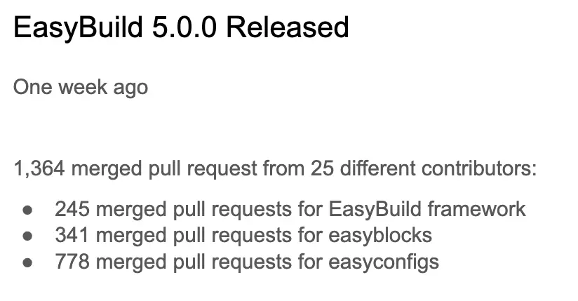
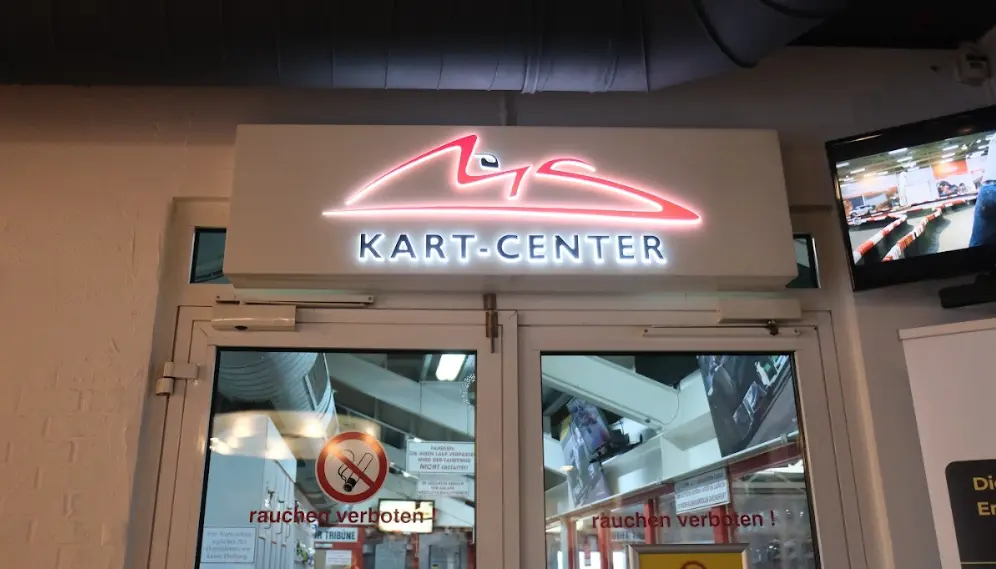
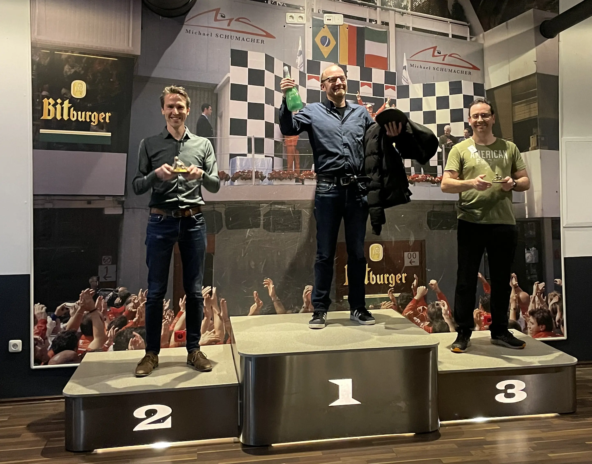

---
authors:
  - hvelab
  - boegel
date: 2025-03-28
slug: eum25
hide:
  - navigation
---

# 10th EasyBuild User Meeting (EUM'25)

## Day 1 (25/03)

### Attendance 
Even with the challenge of having to reach the Jülich Supercomputing Center, the on-site seats for the event were fully booked a month before the event! 

50 people coming by all means possible, car, train, plane, bus, minibus and even bike made it to the venue, in addition to 90 attendees following the event online.

- picture of the brussels team biking? (ask permission)

In person attendees had a first hour of meet and greet, everyone took merchandise to bring home. Once everybody chose a seat, the EUM was ready to start!

During the introduction session, it was revealed that the social activity would be a Karting competition!

### Talks 

First day of talks was packed, starting with the usual EasyBuild State of the Union presentation.

Congratulating all contributors and mantainers, the big highlight surrounding this EUM is the release of **EasyBuild 5.0**! :tada: 

This was covered by the following talk given by Simon Branford (University of Birmingham), EB mantainer, explaining all the breaking changes, updates and new features. It is expected from now on to make a major release of EasyBuild every two years. 

Some other crazy news from the EasyBuild community is the launch of a [swag shop](https://easybuild-eessi-shop.fourthwall.com/en-eur/)! All the profits generated by the shop will be destined to cover future events merchandise.

John Dey (Fred Hutch) and Bart Oldeman (Digital Research Alliance of Canada) gave their site talks illustrating the use of EasyBuild in their respective institutions, remarking some EasyUpdate status updates, new tools to build containers with EasyBuild, user tendencies, special software stacks and their site-specific systems. 

After lunch, a whole round of technical talks filled the afternoon. Starting with Alex Domingo (a.k.a lexming, EB mantainer as well, Vrije Universiteit Brussel) lecturing on Controlling the shell environment in EasyBuild v5.0, with some amazing improvements on how to handle environment variables and how they affect the modulefiles in this new release. Then, Jan André Reuter (JSC) gave tips and tricks on how to contribute (and not break) EasyBuild releases :^)

A friendly competition followed with the two presentations of Robert McLay (TACC - Lmod) and Xavier Delaruelle (CEA - Environment Modules), each one representing their own tools. 

"They got along during the dinner!"

After the coffee break Alexander Grund (TU Dresden) started the session showcasing their development on secure workflows for shared HPC systems to handle sensitive data with minimal performance overhead. In the next talk, Jayesh Badwaik (JSC) addressed reproducibility challenges in continuous benchmarking within the early access program for the JUPITER supercomputer. 

Next one was Michael Klemm (AMD) presented an insightful talk about the AMD ROCm™ Platform, providing an overview of its open-source stack and how it enables high-performance computing with AMD Instinct™ accelerators. 

Moving on another short break, two on-line talks closed the day. The first one introducing Open OnDemand, presented by the Ohio Supercomputing Center team. The second one was the Spack status update, given by the same Todd Gamblin, promising (again) that Spack v1.0 is about to launch, right for the ISC'25.

### Food and Sponsored dinners

Dinner was at Restaurant Hexenturm at dowtown Jülich, sponsored by JSC. We got to eat traditional german and eastern european food in a unique location. :some-emoji-that-hackmd-doesnt-support:

-----

## Day 2 (26/03)

Second day started at 9AM sharp to the keynote of Jeff Hammond titled "Modern MPI and what you need to know about it", highlighting all the efforts in the MPI ABI standarization and modern developments in MPI. Definetly worth a re-watch [here](https://youtu.be/2-4ph2vryiw?list=PLhnGtSmEGEQi5xRViGJwLqZg3HMQJG0QM). 

### Talks

Talks continued with Davide Grassano (CECAM) presenting A new LLVM toolchain for EasyBuild. Covering from how the compiler infrastructure works to a comparison of existing features and performance agains current GCC toolchain.

After the coffee break, Bart Oldeman lectured about the linear algebra infrastructure in EasyBuild's toolchains, how they work and how to squeeze them to get the best performance. Afterwards, Jens Henrik Göbbert (JSC) spoke about OpenGL support in EasyBuild, highlighting how libglvnd works to integrate OpenGL API calls altogether with different vendors. 

And we headed for lunch :spaghetti: Enjoying the sunny day at the JSC's cantine.

- does somebody have a pic? 

Once back, Brian Wylie (JSC) showcased about the POP CoE and their work. Closely related, Markus Geimer (JSC) introduced JSC's in-house tools to trace and do performance analysis of HPC applications. And Alexandre Strube (JSC) explored the State of LLMs in a funny and wonderful talk.  

Closing presentations were the part two of the site-talks. Each one disclosing how they use EasyBuild in their institutions and discussing on some common problems, Caspar van Leeuwen (SURF), Bob Dröge (Universiteit Groningen), Cintia Willemyns (Vrije Universiteit Brussel) and Helena Vela Beltran (Do IT Now) had the honor to bring us to the social activity 

Group picture was taken right before leaving. The sun made a special appearance for the last pics, making it very difficult to keep our eyes open. 

### Social event

The karting competition, sponsored by Do IT Now, had place in the official [Michael Schumacher Kart & Event Center](https://www.ms-kartcenter.de/). Only 25 min away from the JSC. 

Participants recieved a brief training on the procedures and safety as the track runs alongside real Formula 1 cars! :racing_car: :checkered_flag: 

They were split in 3 groups, each group would have to do a classification lap, then 15 minutes of real race. The 4 faster drivers from each group would make it to a final competition. 

The groups that were not driving at the moment could have a lovely time enjoying the intense racing while having some drinks (don't drink and drive in any other situation!).

After a very intense and tight neck-to-neck race, the winners made it to the podium! :champagne:

The winners got a trophy to take home :cup-emoji: 

A well deserved dinner had place right afterwards at "La Piazza" restaurant right above the karting center, sponsored by INUITS/Microsoft/NVIDIA. 

---
## Day 3 (27/03)

Final day of the EUM was focused on EESSI. Lara Peeters (Ghent University) introduced the topic and gave a demo in 11 mins! Showcasing how easy it really is to use EESSI. 

### Talks 

Then, Alan O'Cais (Universitat de Barcelona, CECAM) explained about the MultiXscale CoE and the work inside it. Followed by Pedro Santos Neves (Universiteit Groningen) showcasing the CI/CD environment via EESSI. 

After a coffee break, three on-line talks took place. First one about the EuroHPC Federation Platform given by Henrik Nortamo (CSC.fi), explaining on what it consists and everything that embraces. 

Followed by the presentation on the tool LEXIS, by Martin Golasowski (IT4Innovations), about easy access to HPC workflows and data management. Finishing with Waldur, by Ilja Livenson (University of Tartu), an open-source cloud manager platform with a marketplace. 

Before lunch, all EasyBuild mantainers took a group pic. 
- mantainers pic 

After lunch break, Valentin Volkl (CERN) unpacked the recent developments of CernVM-FS, the tool on which heavily relies EESSI filesystem layer, updating on some new interesting tools and funcionalities. 

Pavel Grochal and Anthony Beerens (INUITS) presented on Improving NVIDIA GPU support in EESSI, showcasing some tools and procedures to ensure compatibility and their results. 

Then Caspar made us a hands-on on the EESSI test suite to try it in our laptops. 

Jörg Saßmannshausen (Imperial College London) started an open discussion on how to recruit and retain IT talents in Research Computing. Highlighting the value of recognition specially with people who is starting their steps in IT and discussing other programs or incentives to attract people to positions in research, having to compete with positions with higher salary inside the IT environment. 

After a short break, four JSC researchers highlighted their work in their respective talks: Test infrastructure for EasyBuild by Sebastian Achilles, and Madita Willsch on "Quantum computing: JUNIQ & co". 

Continuing by the interesting Keynote by Damian Alvarez , ["JUPITER - State of the matters"](https://www.youtube.com/watch?v=dP8H16dfYs0&list=PLhnGtSmEGEQi5xRViGJwLqZg3HMQJG0QM&index=33), explaining all the process and decisions taken to make JUPITER a reality. From the tender procurement, crossing all the bumps in the road and all the work involved to the development point it is right now. 

The talks concluded with the heartwarming presentation by Bernd Mohr, titled ["Four decades of HPC"](https://www.youtube.com/watch?v=pKlDG48_b2A&list=PLhnGtSmEGEQi5xRViGJwLqZg3HMQJG0QM&index=34), where he explained from his experience the evolution of HPC systems when he started working on the field 40 years ago. He even brought some punch cards and old blades! 

### Tour 

The day finished with a tour to the JSC and a visit (from outside) to the Exascale system in construction. Separated in 3 groups, the same JSC personnel attending EUM conducted it. 

### Dinner 

The last sponsored dinner (also by INUITS/Microsoft/NVIDIA) took place in downtown Jülich. Everyone was sad to leave and exhausted after these intense days. Afterall, everybody left happy with some mugs and merchandise, and most importantly, lovely memories to take home.

A heartfelt thank you to everybody attending the EUM and to the sponsors, this year's event will be very difficult to top. :heart: 
