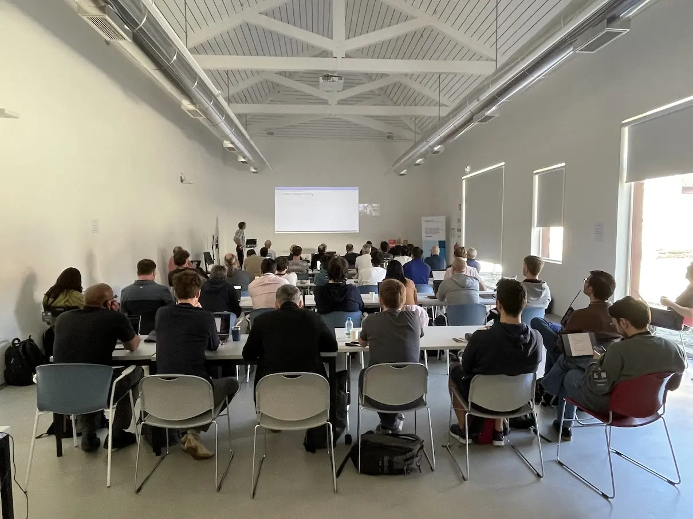
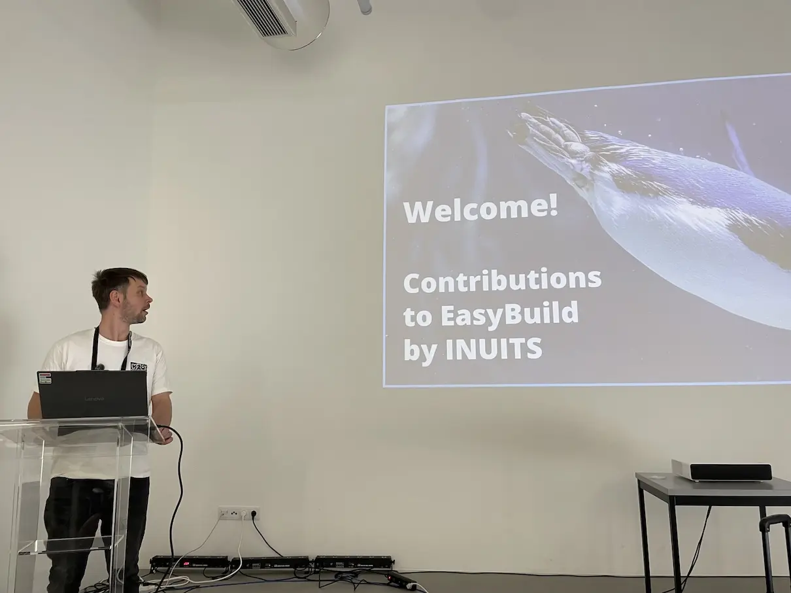
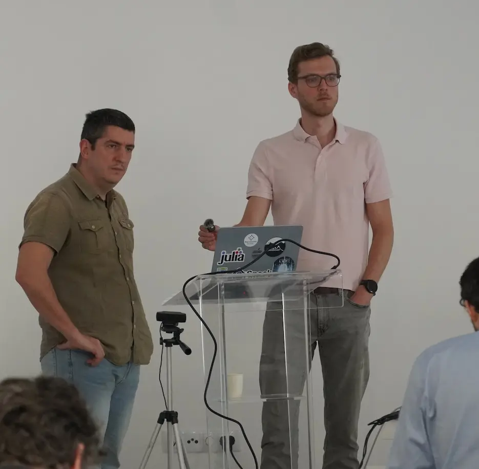
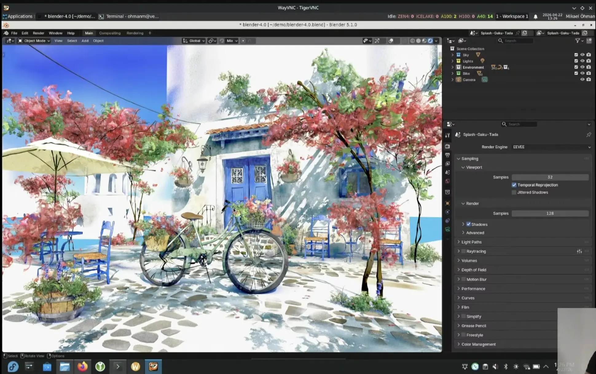
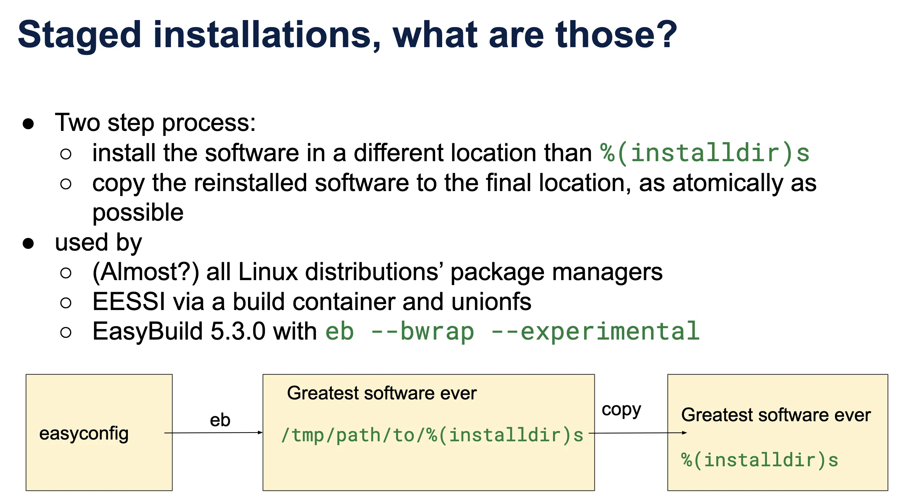
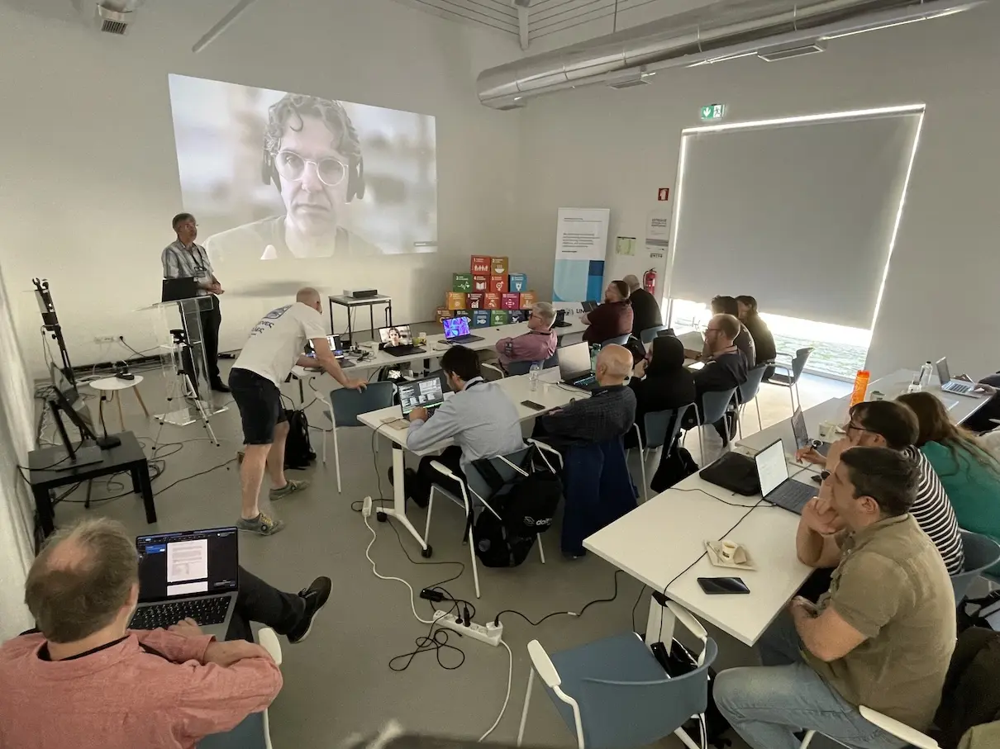
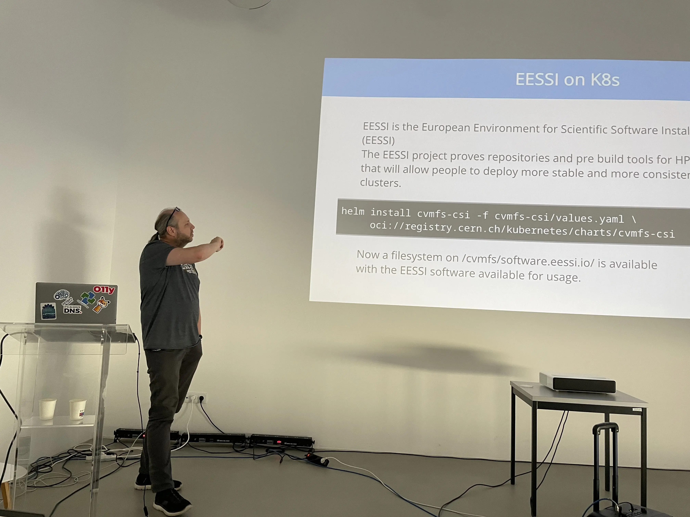
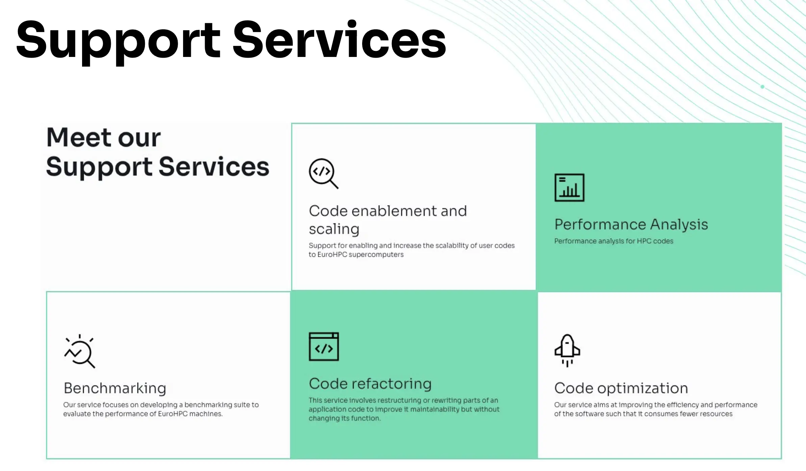
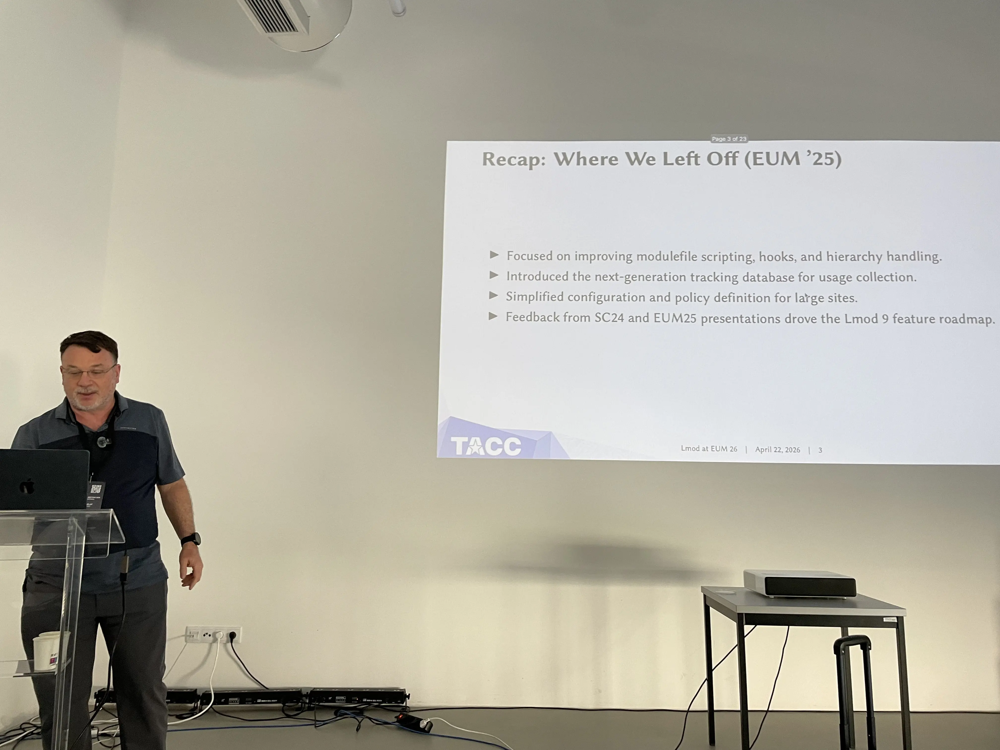
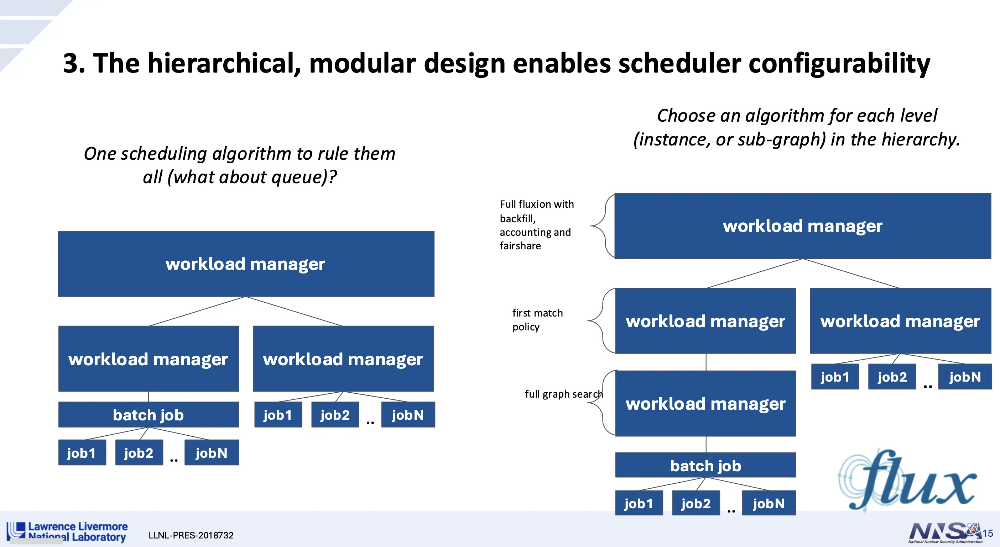

---
authors:
  - boegel
date: 2026-04-22
slug: eum26-day2
hide:
  - navigation
---

# EUM'26 - Day 2

On the second day of the 11th EasyBuild User Meeting (EUM'26), we had a busy agenda
consisting of more EasyBuild site talks, a discussion on the use of LLMs,
presentations focusing on recent developments in EasyBuild, and looking over the fence to
other projects: Spack, Slinky, EPICURE, Lmod, and flux.

<figure markdown="span">
{width=80%}
</figure>

This blog post covers the second day of the 3-day event, see also [day 1](eum26-day1.md) and [day 3](eum26-day3.md).

<!-- more -->

## EasyBuild site talks, part 2

We started in the morning where we left off the day before: letting HPC sites (and friends) give a short presentation
on how they have been using EasyBuild.

- Gavin opened with a talk on the past and future of [Baskerville](https://www.baskerville.ac.uk/), which was a Tier-2 system in the UK,
  but is now evolving into a National Compute Resource. Through a [dedicated website](https://apps.baskerville.ac.uk),
  anyone can browse the (long) list of software installed on Baskerville.
   *([slides](https://users.ugent.be/~kehoste/eum26/eum26_007_Baskerville.pdf) - [recording](https://youtu.be/Wm9V0hI2QfU?list=PLhnGtSmEGEQjTW4HoDDNnjBGUf4v0RgJw&t=0))*
- Next up, Pavel presented an overview of the contributions that [Inuits](https://inuits.eu/), an open source software consultancy company and one of the
  [sponsors of EUM'26](https://easybuild.io/eum26/), has made to EasyBuild in the last couple of years. 
  In total, they have opened over 840 pull requests in the [easyconfigs repository](https://github.com/easybuilders/easybuild-easyconfigs).
  In terms of number of easyconfig files, *over 20%* of those were contributed in 2024 came from Inuits, while last year they had a share of about 13% of all contributed easyconfig files.
  Inuits has been working closely with the [HPC team at Ghent University](https://www.ugent.be/hpc/en), where EasyBuild was created, on this since 2020.
   *([slides](https://users.ugent.be/~kehoste/eum26/eum26_008_INUITS.pdf) - [recording](https://youtu.be/Wm9V0hI2QfU?list=PLhnGtSmEGEQjTW4HoDDNnjBGUf4v0RgJw&t=1405))*
- Ole concluded part 2 of the EasyBuild site talks with a presentation on how EasyBuild has enabled the two-person team that he's a part of at [TU Denmark](https://www.hpc.dtu.dk/)
  to manage a rich central software stack consisting of over 1,000 software installations for their *Niflheim* HPC infrastructure. He also mentioned his
  *documentation, documentation, documentation* mantra, which has resulted in an extensive set of detailed documentation that is publicly
  available at [https://wiki.fysik.dtu.dk](https://wiki.fysik.dtu.dk/). The alternative [*Slurm operations* documentation](https://wiki.fysik.dtu.dk/Niflheim_system/Slurm_operations/)
  they maintain is a particularly useful source of information for the broader HPC community.
   *([slides](https://users.ugent.be/~kehoste/eum26/eum26_009_TUDenmark.pdf) - [recording](https://www.youtube.com/watch?v=Wm9V0hI2QfU&list=PLhnGtSmEGEQjTW4HoDDNnjBGUf4v0RgJw&t=2058s))*

<figure markdown="span">
{width=80%}
</figure>

## LLMs: opportunity, threat, or both?

One topic that was bound to be hard to avoid this year was *Large Language Models (LLMs)*.

In this session, we first looked at results of the AI-related questions in the
latest EasyBuild User Survey.

Some key results from the survey:

- 56% uses AI tools for non-EasyBuild tasks;
- 25% uses it for EasyBuild-related tasks, mostly for easyconfigs;
- 13% is not using AI tools yet, but would like to;
- 22% isn't using it and is also not planning to;

When asked about features in EasyBuild that involve integration with LLMs:

- 30% states they are interested;
- 44% would first like to see what that would entail;
- 24% has a more negative stance and is not interested.

Subsequently, a group discussion was kicked off by raising the question whether LLMs
were an opportunity, a threat, or both at the same time.

Several attendees expressed interest in exploring the potential of using LLMs with EasyBuild,
to help with writing or changing easyconfig files, and identifying problems, debugging them,
and finding solutions. Some EasyBuild maintainers also wondered whether LLMs could help with
processing of incoming contributions.

It was quite clear that the large diversity in views on this topic was an important aspect to take into account.
This was captured well in the recently adopted [EasyBuild AI policy](https://docs.easybuild.io/policies/ai/),
which promises the EasyBuild community that LLMs will not be forced on anyone, and asks contributors
that they clearly declare the use of AI in their pull requests, along with some details on the extent in which it was
used, and to always keep a human in the loop.

*([slides](https://users.ugent.be/~kehoste/eum26/eum26_010_LLMs.pdf) - [recording](https://www.youtube.com/watch?v=xOhJReT8mU8&list=PLhnGtSmEGEQjTW4HoDDNnjBGUf4v0RgJw&index=6&pp=iAQB))*

## Spack

While we always had a *Spack update* talk at the EasyBuild User Meeting, this year we had a first:
we had not just one, but *two* Spack developers joining the event in person.

Harmen started with a lightning-fast introduction to Spack and its core concepts like specs,
parametrized package recipes, concretization, and hashes. He continued with an in-depth overview
of recent developments in Spack, including what has changed in Spack 1.0, which was released summer 2025.

He also showcased the new installer UI, and support for using a POSIX jobserver which results
in composable parallelism.

<figure markdown="span">
{width=80%}
</figure>

Massimiliano then covered additional topics, including support for using a group of specs in
environments, creating OCI container images from the Spack build cache, changes to how Spack
can be configured, and various performance improvements. Most of this will be included
in the upcoming Spack 1.2 release (ETA June 2026).

During Q&A, several interesting questions were raised to them, which led to some puzzled faces for both speakers.
Maybe they were confused about the EasyBuild terminology being used by the attendees? :see_no_evil:

<figure markdown="span">
{width=50%}
</figure>
 
*([slides](https://users.ugent.be/~kehoste/eum26/eum26_011_Spack.pdf) - [recording](https://www.youtube.com/watch?v=ta8ZXl0F6iA&list=PLhnGtSmEGEQjTW4HoDDNnjBGUf4v0RgJw&index=7&pp=iAQB))*

## 3D desktop with EasyBuild

Mikael presented the recent (and ongoing) efforts he and his colleagues have made to
install all that is required to get a 3D desktop environment working in Linux.

He gave a whirlwind tour of the Linux graphics stack, including various concepts
that are likely alien to most of the attendees, like compositors, window managers, buffers, panels, etc.
He also clarified what *server* and *client* mean exactly in this context.

By comparing the old school X11 with the more modern Wayland, he gradually built up
a detailed overview of this complex ecosystem, and covered various gotchas along the way.

He wrapped up the presentation with an impressive demo of a 3D desktop environment that was
installed entirely with EasyBuild. Go check out the recording to see it in action!

<figure markdown="span">
{width=80%}
</figure>

*([slides](https://users.ugent.be/~kehoste/eum26/eum26_012_3d-desktop.pdf) - [recording](https://www.youtube.com/watch?v=oLa3QHUkw9o&list=PLhnGtSmEGEQjTW4HoDDNnjBGUf4v0RgJw&index=8&pp=iAQB))*

## Bubble Wrapping EasyBuild

After a nice lunch break which provided another excellent opportunity for attendees
to network, Bart continued the program with a talk on the integration of [*bubblewrap*,
a.k.a. `bwrap`](https://github.com/containers/bubblewrap) in EasyBuild,
with the help of Sam who was joining remotely as a co-speaker.

Bart explained how `bwrap` can be used to support *staged installations*,
which can later be moved into the final installation prefix semi-atomically.
This way, you can replace existing installations on a production system with minimal interruption.

<figure markdown="span">
{width=60%}
</figure>

Experimental support for this has been added to EasyBuild 5.3.0, via the `--bwrap` configuration option
and the associated `--bwrap-installpath` which specifies the path for the staged installations.

Sam concluded the talk by doing a remote hands-on demo of this experimental EasyBuild feature,
live from Brussels. Check the recording of the talk to see it in action!

The remote participation of Sam made for a funny-looking situation during the Q&A,
when Sam's camera went full screen once he stopped his screen share. :laughing:

<figure markdown="span">
{width=50%}
</figure>
 
*([slides](https://users.ugent.be/~kehoste/eum26/eum26_013_bwrap.pdf) - [recording](https://www.youtube.com/watch?v=198dOxA3Zlo&list=PLhnGtSmEGEQjTW4HoDDNnjBGUf4v0RgJw&index=9&pp=iAQB))*

## Slinky on AKS

Next up, Kris from INUITS presented his adventures with using [Slinky](https://slurm.schedmd.com/slinky.html), a set of tools
to integrate Slurm with Kubernetes, on [Azure Kubernetes Service (AKS)](https://learn.microsoft.com/en-us/azure/aks/what-is-aks), an effort that was done in collaboration with Microsoft.

After a quick high-level introduction by Hugo from Microsoft, Kris gave a detailed overview of his work
using Slinky to get Slurm working on AKS, and making sure that both Infiniband interconnect and NVIDIA GPUs were fully functional.
For this, he relied on [EESSI](https://www.eessi.io/) to run [GROMACS](https://www.gromacs.org/) as a test case.

<figure markdown="span">
{width=80%}
</figure>

Documentation, code, and examples are available via a dedicated [GitHub repository `slinky-aks-demo`](https://github.com/krisbuytaert/slinky-aks-demo).
 
*([slides](https://users.ugent.be/~kehoste/eum26/eum26_014_Slinky.pdf) - [recording](https://www.youtube.com/watch?v=moiFuEwxBXY&list=PLhnGtSmEGEQjTW4HoDDNnjBGUf4v0RgJw&index=10&pp=iAQB))*

## EasyBuild site talks, part 3

Following several longer talks, it was time for another series of shorter EasyBuild site talks:
 
- Alexander, a.k.a. the infamous [`@Flamefire`](https://github.com/Flamefire) on GitHub,
  presented the plans of the HPC team at [TU Dresden](https://tu-dresden.de/zih?set_language=en)
  to start using [EESSI](https://eessi.io) as a base for their central software stack, and the related challenges
  and questions that have emerged.
   *([slides](https://users.ugent.be/~kehoste/eum26/eum26_015_TUDresden.pdf) - [recording](https://www.youtube.com/watch?v=iQ9924lIZJY&list=PLhnGtSmEGEQjTW4HoDDNnjBGUf4v0RgJw&index=11&pp=iAQB&t=0))*
- Xavier outlined how [LuxProvide](https://www.luxprovide.lu/) is using EasyBuild to manage the
  [MeluXina](https://docs.lxp.lu/system/overview/) User Software Environment
  ([MUSE](https://docs.lxp.lu/first-steps/software_env/#the-meluxina-user-software-environment-muse)).
  He also briefly covered the improvements he implemented to the Slurm job backend of EasyBuild,
  for which a [pull request](https://github.com/easybuilders/easybuild-framework/pull/5177) was opened,
  and teased the ongoing exploratory work on creating an AI coding assistant for EasyBuild.
   *([slides](https://users.ugent.be/~kehoste/eum26/eum26_016_LuxProvide.pdf) - [recording](https://www.youtube.com/watch?v=iQ9924lIZJY&list=PLhnGtSmEGEQjTW4HoDDNnjBGUf4v0RgJw&index=11&pp=iAQB&t=1449))*
- Thomas wrapped up this session with a presentation on the work that [Gluo](https://gluo.be/) has been doing
  for [BASF](https://www.basf.com/) with EasyBuild over the last couple of years. He explained how they have
  transitioned from manual software installations in 2017 to installing modules using EasyBuild, using a [custom
  module naming scheme named `GenerationModuleNamingScheme`](https://github.com/easybuilders/easybuild-framework/pull/3547), 
  and more recently also adopting [CernVM-FS](https://cernvm.cern.ch/fs/) to distribute software installations across Europe,
  the US, and AWS.
   *([slides](https://users.ugent.be/~kehoste/eum26/eum26_017_Gluo-BASF.pdf) - [recording](https://www.youtube.com/watch?v=iQ9924lIZJY&list=PLhnGtSmEGEQjTW4HoDDNnjBGUf4v0RgJw&index=11&pp=iAQB&t=3018))*

## EPICURE

Bibek introduced attendees to [EPICURE](https://epicure-hpc.eu/), which provides support services for EuroHPC projects.

<figure markdown="span">
{width=75%}
</figure>

He showed how EasyBuild is used by EPICURE, and gave a couple of recent examples, including the
[EPICURE Benchmark Suite](https://opencode.it4i.eu/epicure/epicure-benchmark).

*([slides](https://users.ugent.be/~kehoste/eum26/eum26_018_EPICURE.pdf) - [recording](https://www.youtube.com/watch?v=DDfbSOTI9Jk&list=PLhnGtSmEGEQjTW4HoDDNnjBGUf4v0RgJw&index=12&pp=iAQB))*

## Lmod update

We invited Robert McLay to give a remote *Lmod update* talk again.
A bit to our surprise, he refused, because he preferred to fly across the pond instead to give the talk in person!

Robert, now retired from [TACC](https://tacc.utexas.edu/), has presented an update on [Lmod](https://github.com/TACC/Lmod/) 
several times at the EasyBuild User Meeting, and as he mentioned he *still* isn't done talking about it...

<figure markdown="span">
{width=80%}
</figure>

He presented an overview of the recent developments in Lmod, including significant performance improvements,
which led to the release of Lmod 9.0. In addition, he discussed how using AI tooling has helped tremendously
to [document the internals of Lmod](https://lmod.readthedocs.io/en/latest/#overview-and-internal-structure-of-lmod),
and how it helped to find the root cause *and* a fix for a [recent bug](https://github.com/TACC/Lmod/issues/805).
The latest Lmod 9.2 release also includes support for running on top of Lua 5.5, which was released late 2025.

*([slides](https://users.ugent.be/~kehoste/eum26/eum26_019_Lmod.pdf) - [recording](https://www.youtube.com/watch?v=1QkOYpMYU5I&list=PLhnGtSmEGEQjTW4HoDDNnjBGUf4v0RgJw&index=13&pp=iAQB))*

## flux

Last but not least was a remote presentation by Tom Scogland (LLNL) on [flux](https://flux-framework.org/),
a next-generation resource management framework, which is a strong contender for replacing the ubiquitous
Slurm some day.

Tom covered how flux has been in development since 2012, and how it grew to being the system resource manager for
[El Capitan](https://asc.llnl.gov/exascale/el-capitan), the first exascale supercomputer in the US which is
[#1](https://top500.org/system/180307/) in the TOP500 list of supercomputers to date since November 2024.

He also showed how flexibility is one of the core design goals in flux, which is reflected in the hierarchical and
modular design, and the fact that it is extensible, easy to customize, and scalable.

<figure markdown="span">
{width=80%}
</figure>

This talk proved to be an excellent addition to the program, despite flux having no direct connection with EasyBuild (yet).

*([slides](https://users.ugent.be/~kehoste/eum26/eum26_020_flux.pdf) - [recording](https://www.youtube.com/watch?v=xGywlSPoD3c&list=PLhnGtSmEGEQjTW4HoDDNnjBGUf4v0RgJw&index=14&pp=iAQB))*

---

This blog post covered the second day of this 3-day event, see also [day 1](eum26-day1.md) and [day 3](eum26-day3.md).
