---
authors:
  - boegel
date: 2026-04-23
slug: eum26-day3
hide:
  - navigation
---

# EUM'26 - Day 3

On day 3 of the 11th EasyBuild User Meeting (EUM'26), we shifted our focus a bit towards
[EESSI](https://eessi.io), and also featured a guest keynote speaker from Fujitsu. Attendees
actively engaged in discussions, which made it more challenging to stick to the schedule.

<figure markdown="span">
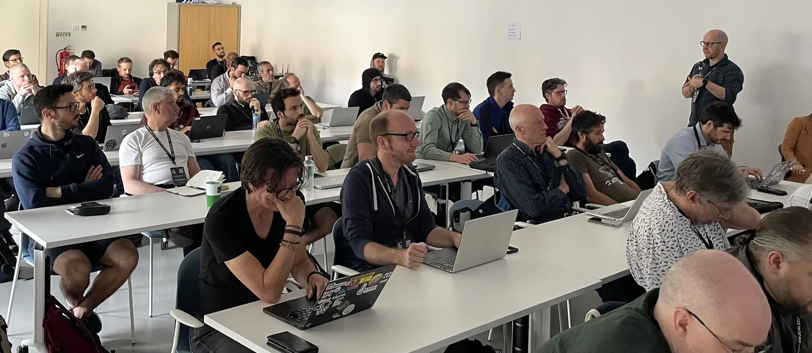{width=100%}
</figure>

This blog post covers the third day of the 3-day event, see also [day 1](eum26-day1.md) and [day 2](eum26-day2.md).

<!-- more -->

## EESSI update

Lara kicked off day 3 of the event with a 45-min introduction and status update on [EESSI](https://eessi.io),
the European Environment for Scientific Software Installations, which originally emerged out of the EasyBuild community.

<figure markdown="span" style="display:flex; gap:0; justify-content:center;">
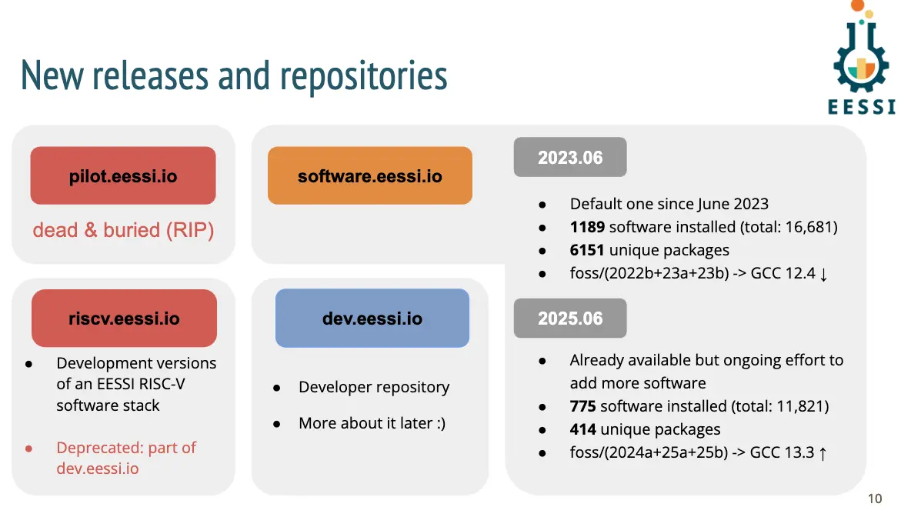{width=50%}
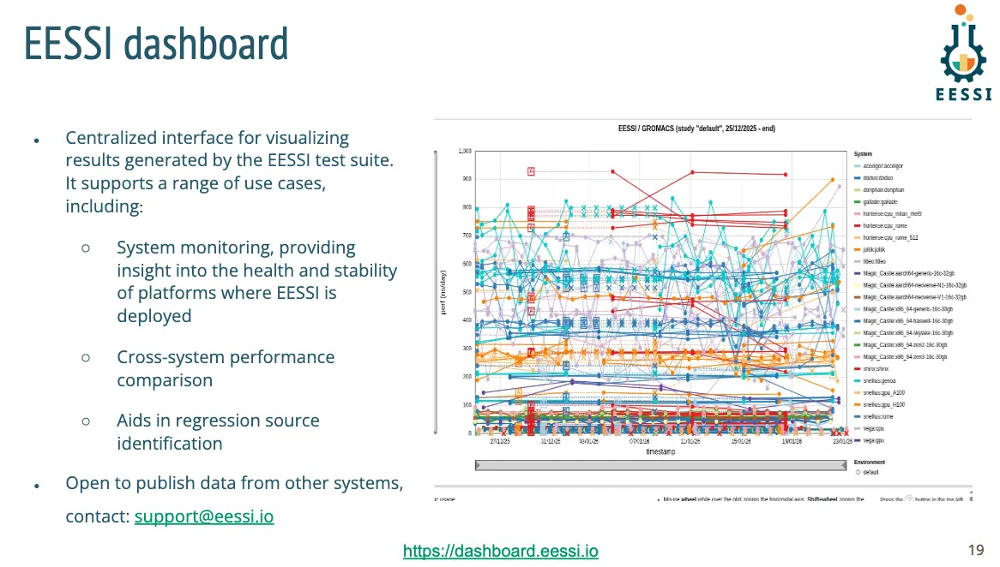{width=50%}
</figure>

Her talk featured a quick live demo of the user experience that EESSI provides,
as well as extensive updates on the software that is [available](https://www.eessi.io/docs/available_software/) in EESSI,
the supported [CPU](https://www.eessi.io/docs/software_layer/cpu_targets/) and [GPU](https://www.eessi.io/docs/software_layer/gpu_targets/) targets,
the [EESSI test suite](https://www.eessi.io/docs/test-suite/) and associated [dashboard](https://dashboard.eessi.io), integration with other
platforms like the [EuroHPC Federation Platform](https://www.eessi.io/docs/blog/2026/03/09/EESSI-in-EFP-update/) and [EOSC](https://www.eessi.io/docs/blog/2025/10/22/eosc/),
and community events like the new [webinars series](https://www.eessi.io/docs/training-events/2026/webinar-series-2026Q2/),
the weekly [Happy Hour sessions](https://www.eessi.io/docs/training-events/happy-hours-sessions/), etc.

*([slides](https://users.ugent.be/~kehoste/eum26/eum26_021_EESSI-update.pdf) - [recording](https://www.youtube.com/watch?v=U8MMHh5me8o&list=PLhnGtSmEGEQjTW4HoDDNnjBGUf4v0RgJw&index=15&pp=iAQB))*

## Keynote on Fujitsu Monaka

Satoshi Nakajima, team Director at the Processor Development division of [Fujitsu](https://global.fujitsu), presented a keynote on the upcoming
[Fujitsu MONAKA processor](https://global.fujitsu/en-global/technology/research/fujitsu-monaka), their next-generation Arm v9-based CPU coming soon (2027),
a follow-up to the [A64FX](https://en.wikipedia.org/wiki/Fujitsu_A64FX) CPUs from 2020 which are used in the
[Deucalion EuroHPC supercomputer](https://deucalion.acnca.pt/).

<figure markdown="span">
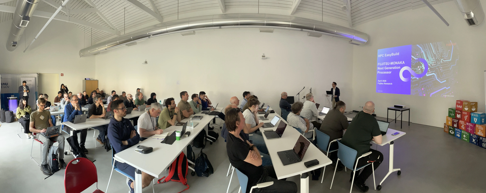{width=100%}
</figure>

He explained how the current agentic AI trend is impossible to ignore, and how that makes it challenging to catch up with other high-end processor designs.

The MONAKA microarchitecture will feature support for Arm SVE2 instructions, and uses a 3D chiplet design with a 2nm core die combining an SRAM and IO die using a 5nm process.
The roadmap for MONAKA already goes beyond 2027, with MONAKA-X (2029) which will be used in "Fugaku NEXT", the follow-up system to [Fugaku](https://www.r-ccs.riken.jp/en/fugaku/).

*(slides coming soon - [recording](https://www.youtube.com/watch?v=QyF3Em6w7XM&list=PLhnGtSmEGEQjTW4HoDDNnjBGUf4v0RgJw&index=16&pp=iAQB0gcJCdwKAYcqIYzv))*

## GPU support in EESSI

Next up, Caspar gave an in-depth status update on the NVIDIA and AMD GPU support in EESSI.

He outlined what is required to run the CUDA-based software installations provided by EESSI (see also [here](https://www.eessi.io/docs/site_specific_config/gpu/#nvidia_drivers)),
what you need to do to also be able to *build* CUDA software yourself on top of EESSI (see also [here](https://www.eessi.io/docs/site_specific_config/gpu/#cuda_sdk)),
and which [generations of NVIDIA GPUs](https://www.eessi.io/docs/software_layer/gpu_targets/) are supported by the different versions of EESSI.

<figure markdown="span" style="display:flex; gap:0; justify-content:center;">
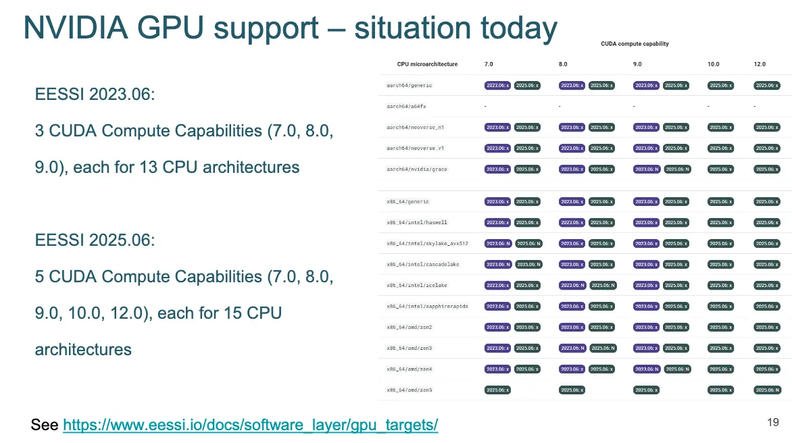{width=50%}
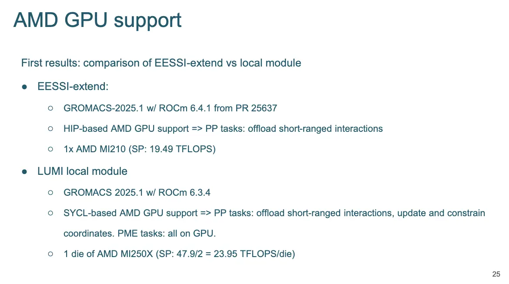{width=50%}
</figure>

In addition, he gave an update on the ongoing work on adding support for AMD GPUs, by making the ROCm ecosystem available in EESSI.
While some challenges still remain, significant progress has been made on that, including support for installing ROCm components and using a ROCm-based compiler toolchain
in EasyBuild v5.3.0.

*([slides](https://users.ugent.be/~kehoste/eum26/eum26_023_EESSI-GPU-support.pdf) - [recording](https://www.youtube.com/watch?v=ACHX17b7KmE&list=PLhnGtSmEGEQjTW4HoDDNnjBGUf4v0RgJw&index=17&pp=iAQB))*

## EESSI CLI tool

As a quick intermezzo, I taunted the demo gods by doing a live hands-on demonstration of (a development version)
of the [command line tool for EESSI](https://github.com/EESSI/eessi-cli).

The main attraction of this tool is currently `eessi check`, which helps to validate your CernVM-FS client configuration
to access the EESSI repositories. The tool also includes a dummy implementation of `eessi init`, and initial support for `eessi shell`
which allows to quickly start a subshell in which the EESSI environment is already initialized.

Example output produced by `eessi check`:
```
📦 Checking for EESSI repositories...
    ✅ OK /cvmfs/dev.eessi.io is available
    ✅ OK /cvmfs/riscv.eessi.io is available
    ✅ OK /cvmfs/software.eessi.io is available

🔎 Inspecting EESSI repository software.eessi.io...
    💻 Client cache:
        ℹ Path to client cache directory: /var/lib/cvmfs/shared
        ℹ Shared cache: yes
        ℹ Client cache quota limit: 9.765625 GiB
        ℹ Cache Usage:  282k / 10240001k
    🌍 Server/proxy settings:
        ℹ List of Stratum-1 mirror servers:
            http://aws-eu-central-s1.eessi.science/cvmfs/software.eessi.io
            http://azure-us-east-s1.eessi.science/cvmfs/software.eessi.io
            http://cvmfs-ext.gridpp.rl.ac.uk:8000/cvmfs/software.eessi.io
        ⚡ WARNING Proxy servers: DIRECT (not recommended, see https://eessi.io/docs/no-proxy)
        ℹ GeoAPI enabled: yes
    💁 Other:
        ℹ Client profile:
```

Support for `eessi install` has been implemented, which allows to quickly install and configure CernVM-FS
on a Linux system so EESSI can be accessed on it, but that currently still sits in an [open pull request](https://github.com/EESSI/eessi-cli/pull/16).

*(no slides, live demo of [eessi](https://pypi.org/project/eessi/) CLI tool - [recording](https://www.youtube.com/watch?v=5VgHFBVh4_0&list=PLhnGtSmEGEQjTW4HoDDNnjBGUf4v0RgJw&index=18&pp=iAQB))*

## JUBE

Thomas introduced attendees to [JUBE](https://github.com/FZJ-JSC/JUBE), the benchmarking environment that is used in [`jubench`](https://github.com/FZJ-JSC/jubench),
the benchmark suite for [JUPITER](https://www.fz-juelich.de/en/jsc/jupiter), the first exascale supercomputer in Europe.

<figure markdown="span" style="display:flex; gap:0; justify-content:center;">
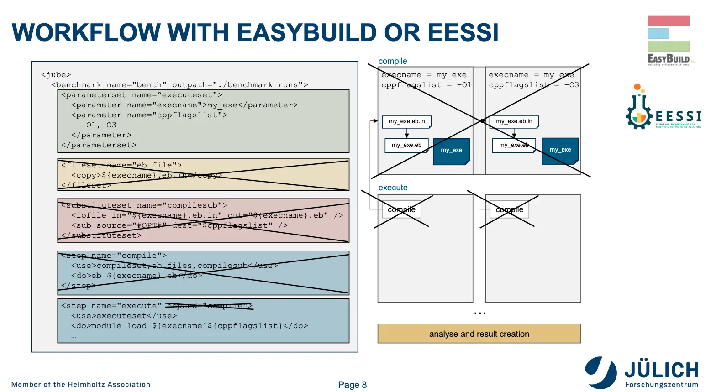{width=80%}
</figure>

He explained how JUBE can be used with or without EasyBuild and EESSI, how to use the `jube` command line interface,
define tests in either XML or YAML, and covered several use cases.

*([slides](https://users.ugent.be/~kehoste/eum26/eum26_025_JUBE.pdf) - [recording](https://www.youtube.com/watch?v=u8cqCQTRysk&list=PLhnGtSmEGEQjTW4HoDDNnjBGUf4v0RgJw&index=19&pp=iAQB))*

## EasyBuild site talks, part 4

The last EasyBuild site talks session featured 4 speakers, covering 3 "sites".

<figure markdown="span">
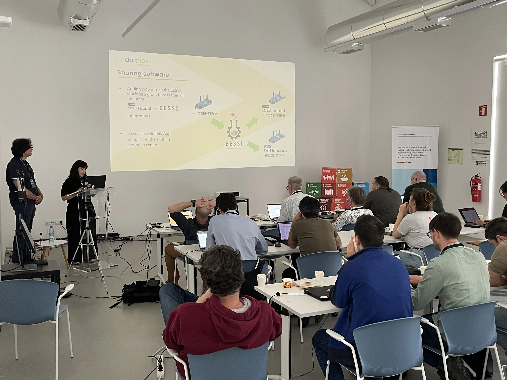{width=80%}
</figure>

- Aurelio and Nádia from [Do IT Now](https://www.doitnowgroup.com/), one of the sponsors of EUM'26,
  outlined the work they have done with both EasyBuild and EESSI for their customers, including some
  integration work with [Open OnDemand](https://www.openondemand.org/).
  <br/>*([slides](https://users.ugent.be/~kehoste/eum26/eum26_026_DoITNow.pdf) - [recording](https://www.youtube.com/watch?v=-6pFASba46A&list=PLhnGtSmEGEQjTW4HoDDNnjBGUf4v0RgJw&index=20))*
- Pedro presented the plans of the HPC team of the [University of Groningen (RUG)](https://www.rug.nl)
  to build the central software stack for their HPC system [Hábrók](https://www.rug.nl/society-business/center-for-information-technology/research/services/hpc/habrok) on top of EESSI.
  <br/>*([slides](https://users.ugent.be/~kehoste/eum26/eum26_027_RUG.pdf) - [recording](https://youtu.be/-6pFASba46A?list=PLhnGtSmEGEQjTW4HoDDNnjBGUf4v0RgJw&t=1288))*
- Finally, Steve from [StackHPC](https://www.stackhpc.com/) talked about their Ansible-based [Slurm Appliance](https://github.com/stackhpc/ansible-slurm-appliance)
  which features support for EESSI.
  <br/>*([slides](https://users.ugent.be/~kehoste/eum26/eum26_028_StackHPC.pdf) - [recording](https://www.youtube.com/watch?v=-6pFASba46A&list=PLhnGtSmEGEQjTW4HoDDNnjBGUf4v0RgJw&t=2756s))*

## LLVM toolchains

Davide presented an overview of the support that EasyBuild has for using LLVM-based toolchains.

He covered the recent developments in LLVM, including a feature comparison that showed that LLVM
is quickly becoming a compelling compiler toolchain for scientific applications, even those
implemented in Fortran.

<figure markdown="span" style="display:flex; gap:0; justify-content:center;">
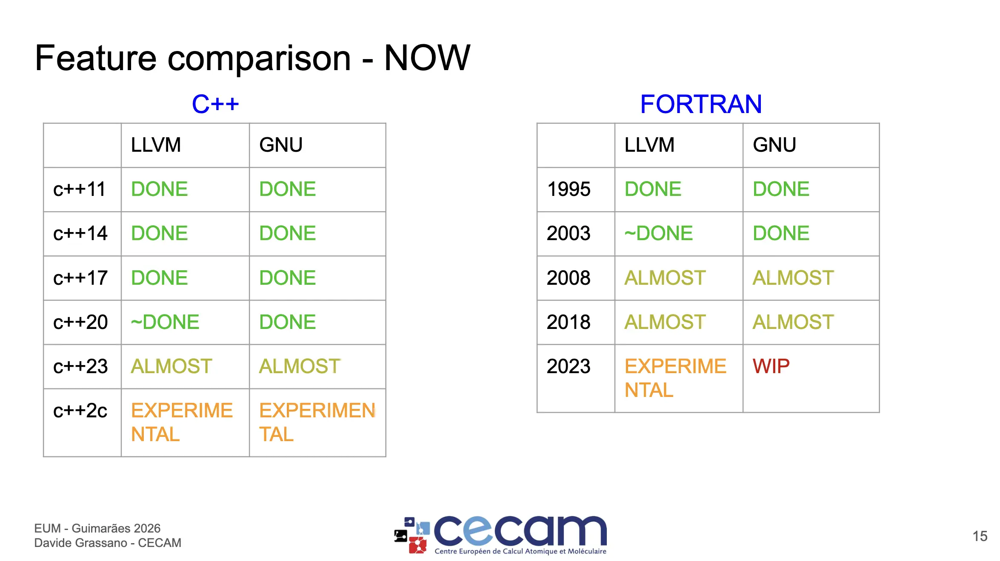{width=80%}
</figure>

In addition, he explained how significant progress has been made in EasyBuild
w.r.t. LLVM, going from support for LLVM-based toolchains like `lfoss`, enhancements
to the easyblock to install LLVM itself and easyblocks for other software to
build them with LLVM compilers, and a collection of easyconfig files using
an LLVM-based toolchain. He also discussed ongoing challenges with building
software with LLVM compilers.

*([slides](https://users.ugent.be/~kehoste/eum26/eum26_029_LLVM-toolchains.pdf) - [recording](https://www.youtube.com/watch?v=iSQvEJoo_Jg&list=PLhnGtSmEGEQjTW4HoDDNnjBGUf4v0RgJw&index=21&pp=iAQB))*

## CernVM-FS

An update on CernVM-FS was presented by Valentin, in which he touched on a variety
of topics, including different publishing options, changes to the CernVM-FS server implementation
related to a containerized deployment of CernVM-FS (on Kubernetes, for example), upcoming features
like support for partial replication in Stratum-1 mirror servers and file bundles, monitoring of CernVM-FS, etc.

<figure markdown="span" style="display:flex; gap:0; justify-content:center;">
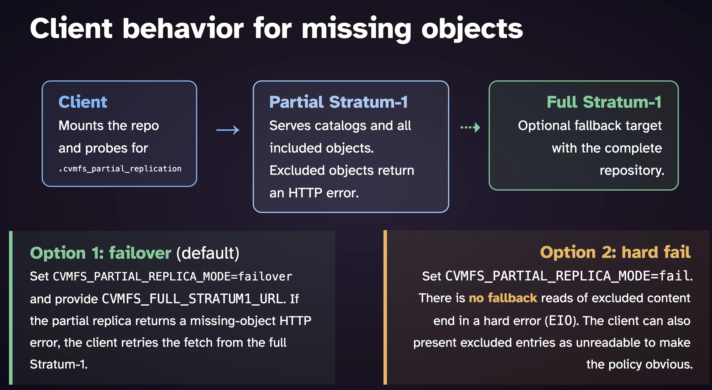{width=50%}
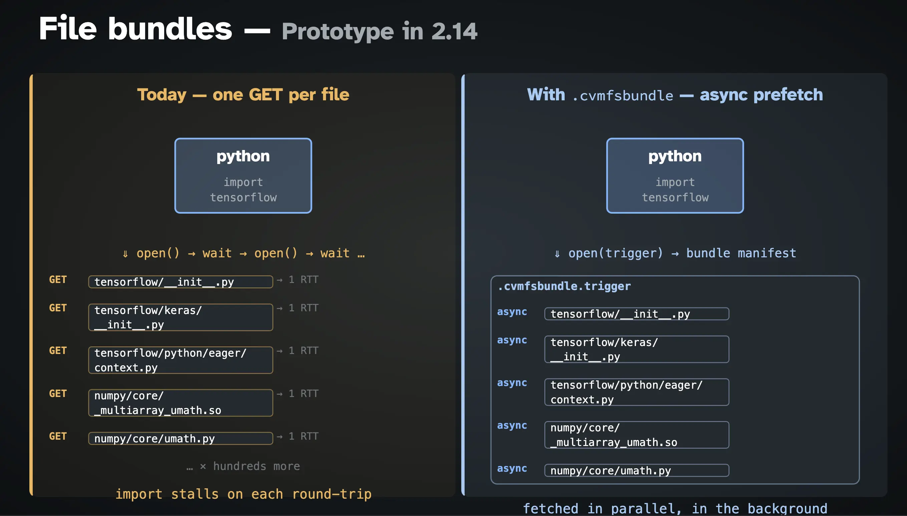{width=50%}
</figure>

*([slides](https://users.ugent.be/~kehoste/eum26/eum26_030_CernVM-FS.pdf) - [recording](https://www.youtube.com/watch?v=mHvjH9VRbrY&list=PLhnGtSmEGEQjTW4HoDDNnjBGUf4v0RgJw&index=22&pp=iAQB))*

## EuroHPC Federation Platform

Last (almost, anyway) but not least, Alan gave an in-depth talk on the [EuroHPC Federation Platform (EFP)](https://my-eurohpc.eu/).

<figure markdown="span" style="display:flex; gap:0; justify-content:center;">
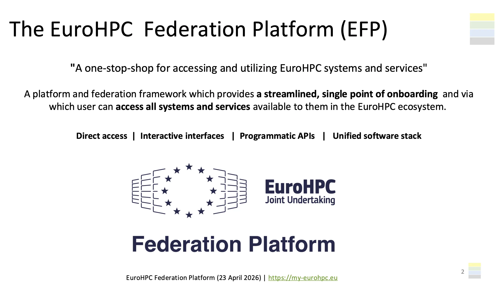{width=50%}
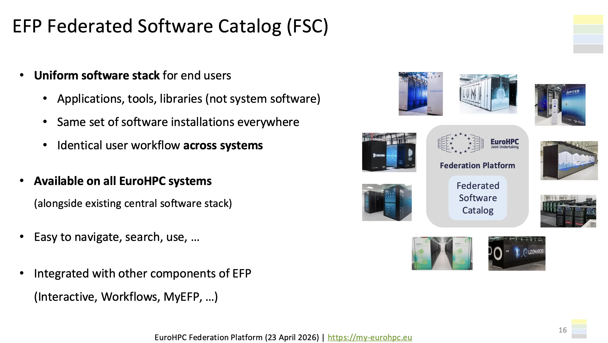{width=50%}
</figure>

He focused on the integration of EESSI in EFP as the *Federated Software Catalog* for EuroHPC systems.
In addition, he gave a live hands-on demonstration to show how EFP will make accessing and using
EuroHPC systems easier.

This triggered a variety of questions, suggestions, and remarks, which resulted
in the talk consuming a bit more time than was originally planned for. Whoever scheduled this talk at
the very end was a wise man...

*([slides](https://users.ugent.be/~kehoste/eum26/eum26_031_EuroHPC-Federation-Platform.pdf) - [recording](https://www.youtube.com/watch?v=Y_5y1JHlTk4&list=PLhnGtSmEGEQjTW4HoDDNnjBGUf4v0RgJw&index=23))*

## Future of EasyBuild, including v6.0

We wrapped up the meeting with a brief outlook to the future of EasyBuild, including
the plans for a new major version of EasyBuild (v6.0.0), which is scheduled to be released
in Spring 2027.

*([slides](https://users.ugent.be/~kehoste/eum26/eum26_032_EasyBuild-future.pdf) - [recording](https://www.youtube.com/watch?v=EIq-zQWDL3Y&list=PLhnGtSmEGEQjTW4HoDDNnjBGUf4v0RgJw&index=24&pp=iAQB0gcJCdwKAYcqIYzv))*

## EUM'27?

What about next year, will there be an EasyBuild User Meeting again? *Of course there will be!*

Exact dates and location are yet to be decided, stay tuned for more information
some time after summer 2026...

